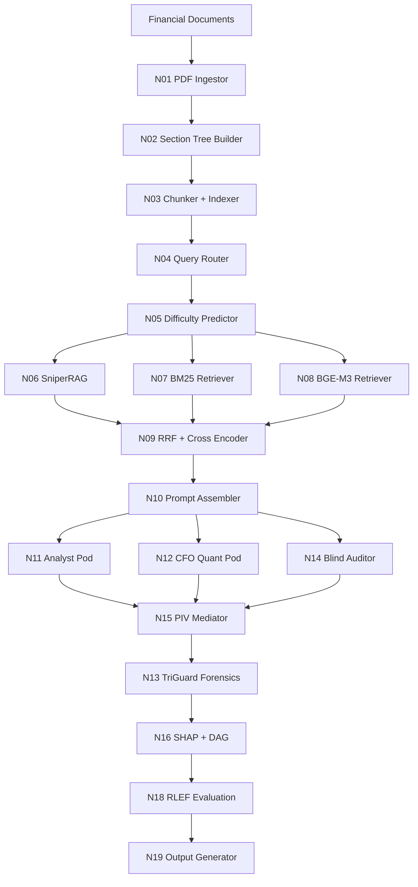

# 🚀 FinBench Multi-Agent Business Analyst AI

> **Production-grade AI system for financial document intelligence, forensic analysis, and explainable business analytics.**

---

# 📌 Overview

FinBench Multi-Agent Business Analyst AI is a fully local, deterministic, multi-agent AI platform designed to analyze complex financial documents such as:

- SEC 10-K filings
- SEC 10-Q filings
- 8-K reports
- Earnings call transcripts
- Financial statements
- iXBRL documents

The system combines:

- Multi-agent reasoning
- Hybrid retrieval architecture
- Explainable AI
- Financial forensics
- Deterministic validation pipelines
- Business-grade PDF reporting

Unlike cloud-based financial AI systems, this platform operates completely offline using local inference.

That means:

✅ Zero API cost  
✅ No vendor lock-in  
✅ No sensitive financial data leakage  
✅ Fully reproducible outputs  
✅ Enterprise-style explainability  

---

# 🧠 Core Vision

Most financial analysis systems today rely heavily on:

- expensive proprietary APIs
- black-box reasoning
- cloud infrastructure
- hidden prompt engineering
- non-reproducible outputs

This project takes the opposite approach.

The objective is to build a:

> transparent, explainable, deterministic, locally executable financial analyst AI.

The system is engineered to explore how far small local models can go when combined with:

- advanced retrieval pipelines
- structured validation
- multi-agent debate
- financial forensic analysis
- deterministic orchestration

---

# ⚡ Key Highlights

| Feature | Description |
|---|---|
| 🧩 Multi-Agent System | Multiple specialized AI pods collaborate and cross-check outputs |
| 🏠 100% Local Inference | Runs completely offline using Ollama |
| 💰 Zero API Cost | No OpenAI or paid API dependency |
| 📊 Financial Forensics | Benford analysis, anomaly detection, GARCH risk logic |
| 🔍 Hybrid Retrieval | BM25 + Dense Retrieval + Cross-Encoder reranking |
| 📑 Explainable Outputs | SHAP graphs + Causal DAG reasoning |
| 🧪 Deterministic Pipeline | Fixed seed outputs with reproducibility |
| 🛡 Hallucination Reduction | Blind Auditor and Validator loops |
| 📄 Automated PDF Reports | Generates professional business analyst reports |
| ⚙️ Production Architecture | 19-node orchestrated pipeline |

---

# 🖼 System Architecture

## High-Level Pipeline



---

# 🏗 19-Node Deterministic Architecture

## 📥 Ingestion Layer

### N01 — PDF Ingestor
Handles:

- PDF extraction
- OCR processing
- scanned documents
- image-based tables
- text normalization

### N02 — Section Tree Builder
Creates structured hierarchy:

- headings
- subsections
- financial sections
- semantic grouping

### N03 — Chunker + Indexer
Builds optimized retrieval chunks with metadata tagging:

```text
COMPANY / DOC_TYPE / FY / SECTION / PAGE
```

---

## 🧭 Routing Layer

### N04 — CART Router
Classifies user query type into categories such as:

- financial metrics
- risk analysis
- accounting questions
- growth analysis
- forensic detection

### N05 — Logistic Regression Difficulty Predictor
Predicts:

- complexity
- retrieval depth
- reasoning requirements
- compute path

---

## 🔎 Retrieval Layer

### N06 — SniperRAG
Ultra-fast regex/direct-hit retrieval.

Best for:

- exact figures
- percentages
- line-item extraction
- fiscal references

Latency:

```text
< 50 ms
```

---

### N07 — BM25 Sparse Retrieval
Traditional keyword-based retrieval.

Strengths:

- accounting terminology
- exact wording
- financial statement matching

---

### N08 — BGE-M3 Dense Retrieval
Semantic embedding retrieval.

Strengths:

- contextual understanding
- paraphrased financial questions
- semantic matching

---

### N09 — RRF + Cross Encoder
Combines all retrieval outputs using:

- Reciprocal Rank Fusion
- Cross-Encoder reranking
- confidence optimization

---

# 🤖 Multi-Agent Intelligence System

## N11 — Analyst Pod
Primary business analysis engine.

Responsibilities:

- interpret filings
- answer financial questions
- summarize trends
- provide contextual explanations

Uses:

```text
PIV Loop:
Planner → Implementor → Validator
```

---

## N12 — CFO / Quant Pod
Focused on:

- formulas
- quantitative logic
- ratio analysis
- earnings validation
- forecasting logic

---

## N14 — Blind Auditor
Independent verification agent.

Critical feature:

> The Blind Auditor never sees the outputs of the other agents.

This dramatically reduces:

- hallucinations
- self-confirmation bias
- cascading reasoning errors

---

## N15 — PIV Mediator
Acts as the final decision layer.

Responsibilities:

- compare pod outputs
- resolve conflicts
- perform majority validation
- trigger mediation retries

---

# 🛡 Financial Forensics Engine

## N13 — TriGuard Forensics
Advanced fraud and anomaly detection system.

Includes:

### 📈 Benford Analysis
Detects suspicious numerical distributions.

### 🌲 Isolation Forest
Finds outliers and anomalies.

### 📉 GARCH Modeling
Analyzes volatility and risk behavior.

---

# 📊 Explainable AI Layer

## N16 — SHAP Explainability
Shows:

- feature importance
- retrieval influence
- reasoning transparency

---

## N16 — Causal DAG Engine
Builds dependency relationships such as:

```text
Revenue → Operating Income → EPS → Valuation
```

This helps explain:

- why predictions occurred
- which variables influenced outcomes
- financial dependency chains

---

# 🧪 RLEF Evaluation Engine

## N18 — Reinforcement Learning Evaluation Framework
Every output is graded automatically.

Checks include:

- factual grounding
- citation quality
- financial consistency
- completeness
- reasoning validity
- confidence alignment

This creates a self-improving evaluation loop.

---

# 📄 Professional PDF Report System

Each query produces a detailed 14-page business analyst report.

## Included Sections

| Page | Content |
|---|---|
| 1 | Executive Cover |
| 2 | Financial Summary Dashboard |
| 3 | Final Answer Card |
| 4 | Step-by-Step Reasoning |
| 5 | Retrieval Evidence |
| 6 | Multi-Agent Comparison |
| 7 | Financial Forensics |
| 8 | SHAP Explainability |
| 9 | Causal DAG |
| 10 | Extracted Charts |
| 11 | Methodology |
| 12 | Citation Appendix |
| 13 | Validator Audit Trail |
| 14 | Reproducibility Details |

---

# 📸 Example Report Visuals

## Executive Dashboard


---

## Retrieval Pipeline Visualization


---

## Multi-Agent Consensus Engine


---

## Financial Forensics Analysis


---

# ⚙️ Technology Stack

| Component | Technology |
|---|---|
| LLM Engine | qwen2.5:3b / Gemma4:e4b |
| Local Serving | Ollama |
| Vector Store | ChromaDB |
| Dense Embeddings | BAAI/bge-m3 |
| Sparse Retrieval | BM25 |
| Orchestration | LangGraph |
| ML Routing | Scikit-Learn |
| Explainability | SHAP |
| UI | Streamlit |
| PDF Reports | ReportLab |
| Data Science | NumPy + Pandas |

---

# 📈 Current Performance

## Latest Internal Smoke Test

| Metric | Result |
|---|---|
| Apple FY2023 Questions | 5/5 Correct |
| Average Confidence | 0.980 |
| Query Speed | ~0.8 sec |
| Local Inference | 100% |
| API Cost | $0 |

---

# 🧠 Why This Architecture Matters

Most RAG systems stop at:

```text
Retriever → LLM → Output
```

This project goes far beyond that.

The architecture introduces:

- multi-agent debate
- blind auditing
- forensic validation
- deterministic orchestration
- structured reasoning
- explainability systems
- retrieval confidence fusion
- grading and feedback loops

This transforms the system from:

```text
Simple chatbot
```

into:

```text
Business Analyst AI Platform
```

---

# 🔐 Engineering Constraints

These are hard-enforced architectural rules.

| Constraint | Enforcement |
|---|---|
| Zero API Cost | No paid API packages allowed |
| Local-Only Inference | No cloud dependency |
| Deterministic Outputs | seed=42 enforced globally |
| Memory Cap | ≤14GB RAM |
| Validation First | Every response audited |
| Context Before Question | Mandatory prompt structure |
| Citation Enforcement | Metadata prefixing required |

---

# 🧰 Installation Guide

## Prerequisites

- Python 3.11+
- Ollama installed locally
- 14 GB RAM
- Optional GPU acceleration

---

## Installation

### Clone Repository

```bash
git clone <repository>
cd finbench_agent
```

---

### Install Dependencies

```bash
pip install -r requirements.txt
```

---

### Pull Local Model

```bash
ollama pull qwen2.5:3b
```

---

### Run Application

```bash
streamlit run app.py
```

---

# 📂 Project Structure

```text
finbench_agent/
│
├── src/
│   ├── ingestion/
│   ├── retrieval/
│   ├── agents/
│   ├── explainability/
│   ├── forensics/
│   ├── output/
│   ├── pipeline/
│   └── utils/
│
├── tests/
├── eval/
├── outputs/
├── app.py
├── requirements.txt
└── README.md
```

---

# 🛣 Roadmap

| Phase | Status |
|---|---|
| Retrieval Engine | ✅ Complete |
| Multi-Agent Pods | ✅ Complete |
| PDF Reporting | ✅ Complete |
| Real-Time Data Feeds | ✅ Complete |
| FinanceBench Evaluation | 🔬 In Progress |
| QLoRA Fine-Tuning | 📅 Planned |
| DPO Optimization | 📅 Planned |
| Ollama Hub Release | 📅 Planned |

---

# 🎯 Potential Real-World Use Cases

## Enterprise Finance Teams

- SEC analysis
- earnings analysis
- risk assessment
- investment research

## Hedge Funds

- anomaly detection
- market intelligence
- filing comparison
- signal extraction

## Researchers

- explainable finance AI
- RAG experimentation
- deterministic agent systems
- financial NLP research

## Students & Developers

- multi-agent system learning
- LangGraph orchestration
- financial AI experimentation
- local LLM architecture

---

# 🏁 Final Summary

FinBench Multi-Agent Business Analyst AI is not just another RAG chatbot.

It is a:

- deterministic AI analyst
- explainable financial intelligence engine
- multi-agent reasoning framework
- forensic validation system
- reproducible research platform

built entirely around:

```text
Local AI + Financial Reasoning + Explainability + Determinism
```

---

# 📚 Acknowledgements

- Ollama
- LangGraph
- FinanceBench
- BAAI/bge-m3
- ReportLab
- Streamlit
- Claude AI
- Google Colab
- Open-source AI community
- FinanceBench benchmark
